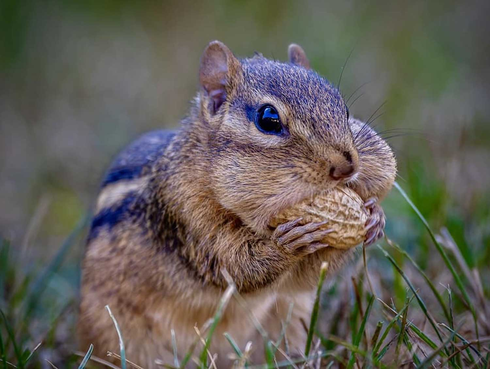
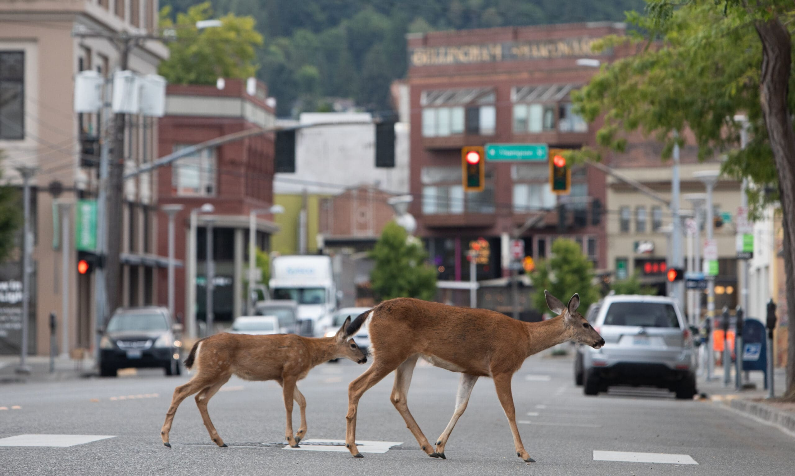

# Getting Started {#sec-setup}

Welcome to the `multiScaleR` workshop! In this hands-on tutorial, you will learn how to use the `multiScaleR` R package to identify the spatial scale at which environmental variables influence species' distributions and abundance. We will work with real camera trap data from the Cleveland Metroparks (Moll et al. 2019, *Ecography*) and analyze three mammal species that illustrate contrasting patterns:

1.  **Domestic cat**: a small-scale positive response to urbanization
2.  **Eastern chipmunk**: a boundary case that teaches us about diagnostic interpretation
3.  **White-tailed deer**: a landscape-scale positive response to urbanization

By the end of this workshop you will be able to:

-   Prepare spatial data for scale of effect analysis
-   Optimize kernel scale parameters using `multiScaleR`
-   Interpret results, including boundary cases and diagnostic profiles
-   Extend analyses from composite covariates to individual land cover types
-   Project predictions across a landscape

## How to Use This Tutorial

Open `multiScaleR_workshop.qmd` in RStudio and run code chunks interactively using the green "play" button or `Ctrl+Enter` (`Cmd+Enter` on Mac). Work through the sections in order, as later sections build on objects created earlier.

## Prerequisites

::: callout-note
## Required Packages

Make sure you have the following packages installed before we begin. If any are missing, install them with `install.packages()`. Install `multiScaleR` from GitHub using `remotes::install_github("wpeterman/multiScaleR")`.

**Minimum 8 GB of RAM is recommended.** The deer analysis (Section 6) requires approximately 1.5 GB.
:::

```{r}
#| label: setup
#| eval: true

library(multiScaleR)
library(terra)
library(sf)
library(readxl)
library(MASS)
library(ggplot2)
library(dplyr)

# Verify multiScaleR version
if (packageVersion("multiScaleR") < "0.6.11") {
  warning("multiScaleR >= 0.6.11 is required for this tutorial. Update with remotes::install_github('wpeterman/multiScaleR')")
}

# Set file paths -- UPDATE THESE to match your local directory
DATA_DIR <- "data"
PRECOMP_DIR <- "precomputed"
```

## Workshop Roadmap

| Section | Topic                                  | Time   |
|---------|----------------------------------------|--------|
| 1       | Setup and prerequisites                | 15 min |
| 2       | What is a scale of effect?             | 20 min |
| 3       | Data loading and exploration           | 25 min |
| 4       | Domestic cat: full workflow            | 40 min |
| 5       | Eastern chipmunk: a boundary case      | 25 min |
| --      | Break                                  | 15 min |
| 6       | White-tailed deer: landscape scale     | 30 min |
| 7       | Beyond the PCA: development and forest | 35 min |
| 8       | Spatial prediction                     | 25 min |
| 9       | Summary and next steps                 | 10 min |

# What Is a Scale of Effect? {#sec-concepts}

## The Problem

The effect of a landscape variable on a species is typically strongest at a particular spatial scale, often called the **scale of effect** (Holland et al. 2004). For example, a species might respond to the proportion of forest within 200 m of a site, while another species responds to forest cover within 5 km. Analyzing at the wrong scale can lead to underestimated effects, incorrect conclusions about variable importance, and biased model predictions (Miguet et al. 2016).

## Traditional Approach: Fixed Buffers

The most common approach to determining scale of effect is to calculate the mean of a landscape covariate within buffers of increasing radius around focal sites (e.g., 100 m, 250 m, 500 m, 1000 m), then select the buffer size that produces the best-fitting model using AIC. This approach has several limitations: it unrealistically assumes the effect of a variable is constant within the buffer and zero beyond it, it requires choosing discrete buffer sizes in advance, and it does not provide a formal estimate of uncertainty around the scale of effect.

## The `multiScaleR` Approach: Kernel Smoothing

`multiScaleR` takes a different approach. Instead of fixed buffers, it uses a continuous **distance-weighted kernel function** to weight landscape values around each sample point. Locations closer to the focal site receive higher weight, and the weight decays smoothly with distance according to a kernel function parameterized by **sigma** ($\sigma$). The package then estimates sigma as a regression parameter, optimizing it simultaneously with the model coefficients to find the scale that maximizes model fit.

The key parameter is **sigma**, which controls the spatial extent of the kernel. A small sigma means the species responds to local conditions (steep distance decay), while a large sigma means the species responds to broader landscape conditions (gradual decay).

Let's visualize how sigma controls the kernel shape:

```{r}
#| label: fig-kernels
#| fig-cap: "Gaussian kernels at three sigma values. Small sigma (left) concentrates weight near the focal site. Large sigma (right) distributes weight across a broad landscape extent."
#| fig-width: 10
#| fig-height: 4

par(mfrow = c(1, 3))
plot_kernel(sigma = 100, kernel = "gaussian", main = "sigma = 100 m")
plot_kernel(sigma = 500, kernel = "gaussian", main = "sigma = 500 m")
plot_kernel(sigma = 2000, kernel = "gaussian", main = "sigma = 2000 m")
```

::: callout-important
## Methodological Note

Moll et al. (2019) used hierarchical Bayesian multi-species models (JAGS) to jointly estimate scales of effect across 14 mammal species. In this workshop, we use `multiScaleR` to fit frequentist single-species negative binomial GLMs. The core concept (Gaussian kernel smoothing of landscape covariates) is the same, but our estimates will differ because we are fitting independent models for each species and using maximum likelihood rather than MCMC. The general patterns should be consistent.
:::

# Data Loading and Exploration {#sec-data}

## Study System

Moll et al. (2019) surveyed the mammal community of the Cleveland Metroparks, an extensive urban park system in Cleveland, Ohio, USA. They deployed 207 camera traps across 18 reservations distributed along an urban-to-rural gradient. Cameras recorded approximately 60,000 wildlife detections of 14 mammal species across winter (December 2015 to April 2016) and summer (June to September 2016) seasons.

To quantify urbanization, Moll et al. conducted a principal components analysis (PCA) on three raster layers derived from the 2016 National Land Cover Database: (1) a binary developed/non-developed layer, (2) a binary forested/non-forested layer, and (3) proportion impervious surface. The first principal component explained \~61% of the variance and serves as a composite urbanization covariate. Higher values indicate more developed, less forested areas.

## Load Camera Locations

```{r}
#| label: load-cameras

cam_locs <- read_excel(file.path(DATA_DIR, "camera_locations.xlsx"),
                       sheet = "summer")
str(cam_locs)
```

::: callout-note
The camera locations file has two sheets: "summer" (207 sites) and "winter" (104 sites). We will use the summer data throughout this workshop.
:::

## Load Detection Data

The detection data are stored as a 3D array with dimensions: 207 sites x 18 weeks x 14 species. The array has no dimension names, so species must be identified by their index position.

```{r}
#| label: load-counts

summer <- readRDS(file.path(DATA_DIR, "summer_counts.rds"))
dim(summer)

# Species are indexed in this order:
# 1=Dom.cat, 2=E.chipmunk, 3=Coyote, 4=Deer, 5=Fox squirrel,
# 6=Gray squirrel, 7=Mustelid, 8=V.opossum, 9=E.cottontail,
# 10=Raccoon, 11=Red fox, 12=Red squirrel, 13=Str.skunk, 14=Woodchuck

species_names <- c("Domestic cat", "Eastern chipmunk", "Coyote",
                   "White-tailed deer", "Fox squirrel", "Gray squirrel",
                   "Mustelid sp.", "Virginia opossum", "Eastern cottontail",
                   "Raccoon", "Red fox", "Red squirrel",
                   "Striped skunk", "Woodchuck")
```

## Create Site-Level Counts

For our single-species GLM approach, we will sum weekly detections into total counts per site for each focal species.

```{r}
#| label: site-counts

chipmunk_counts <- rowSums(summer[, , 2], na.rm = TRUE)
cat_counts      <- rowSums(summer[, , 1], na.rm = TRUE)
deer_counts     <- rowSums(summer[, , 4], na.rm = TRUE)

# Quick summary
data.frame(
  Species = c("Dom. cat", "E. chipmunk", "Deer"),
  Total = c(sum(cat_counts), sum(chipmunk_counts), sum(deer_counts)),
  Mean = round(c(mean(cat_counts), mean(chipmunk_counts), mean(deer_counts)), 2),
  Sites_detected = c(sum(cat_counts > 0), sum(chipmunk_counts > 0), sum(deer_counts > 0)),
  Sites_zero = c(sum(cat_counts == 0), sum(chipmunk_counts == 0), sum(deer_counts == 0))
)
```

::: panel-tabset
### Domestic cat

```{r}
#| label: fig-hist-cat
#| fig-cap: "Distribution of domestic cat summer counts across 207 camera sites."

hist(cat_counts, breaks = 30, main = "Domestic cat",
     xlab = "Total summer detections", col = "darkorange")
```

### Eastern chipmunk

```{r}
#| label: fig-hist-chipmunk
#| fig-cap: "Distribution of eastern chipmunk summer counts across 207 camera sites."

hist(chipmunk_counts, breaks = 30, main = "Eastern chipmunk",
     xlab = "Total summer detections", col = "steelblue")
```

### White-tailed deer

```{r}
#| label: fig-hist-deer
#| fig-cap: "Distribution of white-tailed deer summer counts across 207 camera sites."

hist(deer_counts, breaks = 30, main = "White-tailed deer",
     xlab = "Total summer detections", col = "darkgreen")
```
:::

::: callout-tip
## Why Negative Binomial?

All three species show right-skewed count distributions with many zeros and high variance relative to the mean. This overdispersion is expected when aggregating weekly counts across an entire season. The negative binomial distribution (`glm.nb` from the `MASS` package) is well suited for this type of data, as it includes an additional dispersion parameter compared to the Poisson distribution.
:::

## Load and Map the Urbanization Raster

```{r}
#| label: load-raster

# Load the PCA urbanization raster
urb_pca <- rast(file.path(DATA_DIR, "urb_pca_na16.tif"))

# Create spatial points from camera locations
cam_sf <- st_as_sf(cam_locs,
                   coords = c("longitude", "latitude"),
                   crs = 4326)

# Transform to the raster's coordinate reference system (projected)
cam_sf <- st_transform(cam_sf, crs(urb_pca))
```

::: callout-warning
## Coordinate Reference System

`kernel_prep()` requires projected coordinates (units in meters) so that buffer distances are meaningful. The camera locations are recorded in WGS84 (latitude/longitude), so we must transform them to match the raster CRS before analysis. Always verify the transformation with `st_crs(cam_sf)`.
:::

```{r}
#| label: fig-study-area
#| fig-cap: "PCA urbanization raster for the Cleveland Metroparks study area. Red/warm colors indicate high urbanization; blue/cool colors indicate low urbanization (more forested). Points show camera trap locations."

plot(urb_pca, main = "PCA Urbanization")
points(vect(cam_sf), cex = 0.5, pch = 16, col = 'red')
```

# Domestic Cat: The Full Workflow {#sec-cat}

{width="60%" fig-align="center"}

Domestic cats are strongly associated with residential areas, and their abundance in natural areas is closely tied to the proximity and density of surrounding human development. Based on their ecology, we expect cats to respond to urbanization at a relatively local scale. Let's see what our single-species analysis reveals.

## Step 1: Prepare Kernel Inputs

The first step in any `multiScaleR` analysis is `kernel_prep()`. This function extracts raster values within a specified buffer radius (`max_D`) around each sample point, computes distances, and sets up the data structures needed for optimization.

```{r}
#| label: cat-kernel-prep

kernel_inputs_cat <- kernel_prep(
  pts = cam_sf,
  raster_stack = urb_pca,
  max_D = 1000,
  kernel = "gaussian",
  progress = FALSE
)
```

::: callout-tip
## Choosing `max_D`

The `max_D` parameter sets the maximum buffer radius for extracting raster values. It should be set larger than your expected scale of effect. If the optimized sigma reaches or approaches `max_D`, you will receive a warning suggesting you increase it. For domestic cats, 1000 m is a reasonable starting value given their association with local residential features. Larger `max_D` values extract more raster cells per point, increasing both memory use and computation time.
:::

```{r}
#| label: cat-kernel-print

# Inspect the kernel_prep output
kernel_inputs_cat
```

## Step 2: Fit an Initial Model

Next, we combine the kernel-weighted covariate values with our count data and fit a negative binomial GLM. The covariate names in `kernel_inputs$kernel_dat` match the raster layer names.

```{r}
#| label: cat-model

dat_cat <- data.frame(
  counts = cat_counts,
  kernel_inputs_cat$kernel_dat
)

# Check the column names
names(dat_cat)

# Fit negative binomial GLM
mod_cat <- glm.nb(counts ~ urb_pca_na16, data = dat_cat)
summary(mod_cat)
```

## Step 3: Optimize Sigma

Now we use `multiScale_optim()` to find the sigma value that maximizes the model log-likelihood. The function uses the L-BFGS-B optimizer to search across sigma values while simultaneously updating the regression coefficients.

```{r}
#| label: cat-optim

opt_cat <- multiScale_optim(
  fitted_mod = mod_cat,
  kernel_inputs = kernel_inputs_cat,
  n_cores = 4,
  PSOCK = TRUE
)
```

::: callout-warning
## Pre-computed Fallback

If the optimization does not complete (e.g., due to memory constraints), you can load a pre-computed result:

``` r
opt_cat <- readRDS(file.path(PRECOMP_DIR, "opt_cat_pca.rds"))
```
:::

## Step 4: Examine Results

```{r}
#| label: cat-summary

summary(opt_cat)
```

The summary reports the optimized sigma, its standard error and 95% confidence interval, and the distance at which 90% of the kernel weight is captured. It also displays the fitted model coefficients.

```{r}
#| label: fig-cat-kernel
#| fig-cap: "Optimized Gaussian kernel for domestic cat response to urbanization. The dashed line marks the distance capturing 90% of the kernel weight."

plot(opt_cat)
```

### Sigma Profile

The `profile_sigma()` function evaluates model fit across a range of sigma values. This is an important diagnostic: a clear minimum in AICc confirms that the optimizer found a well-defined scale of effect rather than a flat or multimodal likelihood surface.

```{r}
#| label: fig-cat-profile
#| fig-cap: "Profile of AICc across sigma values for domestic cat. A clear minimum near sigma = 55 m confirms a well-defined scale of effect."

prof_cat <- profile_sigma(opt_cat, n_pts = 15)
plot(prof_cat)
```

### Marginal Effects

```{r}
#| label: fig-cat-marginal
#| fig-cap: "Marginal effect of PCA urbanization on domestic cat counts. Shading shows the 95% confidence interval."

plot_marginal_effects(opt_cat)
```

::: callout-note
## Interpreting the Cat Results

The estimated sigma of approximately 55 m (90% kernel distance of approximately 90 m) indicates that domestic cats respond to urbanization at a very local scale. The positive coefficient (beta = +0.85, p \< 0.001) means that cat counts increase sharply with urbanization. This is consistent with their dependence on residential areas for food, shelter, and access to the outdoors.

Compared to the Bayesian multi-species estimate from Moll et al. (2019), our frequentist single-species estimate is smaller. This difference likely reflects the methodological differences between the two approaches, including the joint estimation framework used by Moll et al.
:::

# Eastern Chipmunk: A Boundary Case {#sec-chipmunk}

{width="50%" fig-align="center"}

Eastern chipmunks are small-bodied, forest-associated rodents. Based on their ecology, we might expect them to respond to urbanization at a local scale. This example demonstrates what happens when the optimizer cannot find a clear scale of effect, which is a valuable diagnostic outcome.

## Run the Workflow

```{r}
#| label: chipmunk-workflow

# Step 1: kernel_prep
kernel_inputs_chip <- kernel_prep(
  pts = cam_sf,
  raster_stack = urb_pca,
  max_D = 1700,
  kernel = "gaussian",
  progress = FALSE
)

# Step 2: Fit model
dat_chip <- data.frame(
  counts = chipmunk_counts,
  kernel_inputs_chip$kernel_dat
)
mod_chip <- glm.nb(counts ~ urb_pca_na16, data = dat_chip)

# Step 3: Optimize
opt_chip <- multiScale_optim(
  fitted_mod = mod_chip,
  kernel_inputs = kernel_inputs_chip,
  n_cores = 4,
  PSOCK = TRUE
)
```

::: callout-warning
## Pre-computed Fallback

``` r
opt_chip <- readRDS(file.path(PRECOMP_DIR, "opt_chipmunk_pca.rds"))
```
:::

```{r}
#| label: chipmunk-summary

summary(opt_chip)
```

Notice the warnings: the estimated sigma hits the upper boundary (`max_D`), and the standard error is very large relative to the estimate. This tells us the optimizer could not find a well-defined scale of effect within the search range. But why? The `profile_sigma` diagnostic will help us understand what is happening.

## Understanding the Boundary with `profile_sigma`

The sigma profile is the key diagnostic tool for understanding boundary estimates.

::: panel-tabset
### Cat Profile (well-behaved)

```{r}
#| label: fig-profile-cat-compare
#| fig-cap: "Cat sigma profile shows a clear AICc minimum near 55 m."

plot(profile_sigma(opt_cat, n_pts = 15))
```

### Chipmunk Profile (boundary)

```{r}
#| label: fig-profile-chipmunk
#| fig-cap: "Chipmunk sigma profile. AICc is lowest at small sigma values, then rises to a broad plateau. Without a clear minimum, the optimizer gets stuck depending on where it starts."

plot(profile_sigma(opt_chip, n_pts = 15))
```
:::

Look carefully at the chipmunk profile. The AICc values are actually **lowest at small sigma values**, then rise to a broad, flat plateau at larger scales. The optimizer's default starting value (determined internally from `max_D`) lands on this plateau, where the gradient is essentially zero, and it cannot descend to the lower-AICc region.

## The Role of Starting Values

We can demonstrate this by providing a smaller starting value using the `par` argument. The `par` value is specified as a proportion of `max_D` (e.g., `par = 50/1700` starts the optimizer at sigma = 50 m).

```{r}
#| label: chipmunk-seeded

opt_chip_seeded <- multiScale_optim(
  fitted_mod = mod_chip,
  kernel_inputs = kernel_inputs_chip,
  n_cores = 4,
  PSOCK = TRUE,
  par = 50 / 1700
)

summary(opt_chip_seeded)
```

With a lower starting value, the optimizer now finds the **lower boundary** (sigma = 30 m) instead of the upper boundary. The effect is marginally significant (beta = -0.35, p = 0.06) and negative, consistent with chipmunks avoiding urbanized areas at a very local scale.

::: callout-important
## What Does This Tell Us?

The two optimization runs converged to opposite boundaries, and neither found a clear interior minimum. This is a signature of a **monotonically decreasing AICc profile**: the best fit is at the smallest possible sigma, and the surface flattens out at larger scales. The key lessons:

1.  The **profile plot is essential**. Without it, we might trust whichever boundary the optimizer happened to reach, not realizing the surface has no clear minimum.
2.  **Starting values matter** when the likelihood surface has plateaus. If your result lands at a boundary with a large SE, try re-running with a different `par` value to see if the optimizer finds a different region.
3.  For chipmunks, the weak negative effect at very small sigma (p = 0.06) suggests that any relationship with PCA urbanization operates below the raster resolution (30 m) and is not strong enough to produce a well-defined scale of effect. Other covariates (e.g., forest cover alone, canopy density) or other modeling frameworks (e.g., occupancy models) might reveal clearer scale-dependent patterns.

This is a valuable diagnostic outcome. Not every species-covariate combination will produce a clean result, and recognizing when the data do not support a well-defined scale of effect is just as important as finding one.
:::

# White-tailed Deer: A Landscape-Scale Response {#sec-deer}

{width="60%" fig-align="center"}

White-tailed deer are large-bodied, mobile mammals that use landscapes at broad spatial extents. In urbanizing areas, deer often concentrate in remaining natural areas and can actually increase in abundance in moderate-density suburban landscapes. Based on their ecology, we expect their response to urbanization to operate at a much broader scale than either chipmunks or cats.

## Prepare Data with a Larger Buffer

Because we expect a larger scale of effect, we need to increase `max_D`. Note that this increases computation time and memory use, and sites near the raster edge may produce NA values when the buffer extends beyond the available data.

```{r}
#| label: deer-kernel-prep

kernel_inputs_deer <- kernel_prep(
  pts = cam_sf,
  raster_stack = urb_pca,
  max_D = 3000,
  kernel = "gaussian",
  progress = FALSE
)
```

::: callout-note
With `max_D = 3000`, buffers around sites near the edge of the PCA raster (particularly near Lake Erie) will extend beyond the available data. `multiScaleR` handles this gracefully: raster cells outside the boundary are simply excluded from the kernel-weighted average for that site, so all 207 sites can still contribute to the analysis. Be aware that sites whose buffers extend mostly beyond the raster will have their covariate estimates based on fewer cells, which can increase their uncertainty.
:::

## Fit and Optimize

```{r}
#| label: deer-optim

dat_deer <- data.frame(
  counts = deer_counts,
  kernel_inputs_deer$kernel_dat
)
mod_deer <- glm.nb(counts ~ urb_pca_na16, data = dat_deer)

opt_deer <- multiScale_optim(
  fitted_mod = mod_deer,
  kernel_inputs = kernel_inputs_deer,
  n_cores = 4,
  PSOCK = TRUE
)
```

::: callout-warning
## Pre-computed Fallback

``` r
opt_deer <- readRDS(file.path(PRECOMP_DIR, "opt_deer_pca.rds"))
```
:::

```{r}
#| label: deer-summary

summary(opt_deer)
```

The estimated sigma of approximately 770 m indicates a landscape-scale response, with the 90% kernel distance extending to approximately 1267 m. The standard error (approximately 305 m) is moderately large relative to the estimate, which is not uncommon for landscape-scale parameters. For a publication analysis, you might want to increase `max_D` and verify that the estimate stabilizes.

## Three-Species Comparison

::: panel-tabset
### Domestic Cat

```{r}
#| label: fig-compare-cat
#| fig-cap: "Optimized kernel for domestic cat (sigma approximately 55 m)."

plot(opt_cat)
```

### Eastern Chipmunk

```{r}
#| label: fig-compare-chipmunk
#| fig-cap: "Optimized kernel for eastern chipmunk (sigma at upper boundary, no clear scale of effect)."

plot(opt_chip)
```

### White-tailed Deer

```{r}
#| label: fig-compare-deer
#| fig-cap: "Optimized kernel for white-tailed deer (sigma approximately 770 m)."

plot(opt_deer)
```
:::

```{r}
#| label: three-species-table

# Summary comparison
data.frame(
  Species = c("Domestic cat", "E. chipmunk", "White-tailed deer"),
  Sigma_m = c(
    summary(opt_cat)$opt_scale$Mean,
    summary(opt_chip)$opt_scale$Mean,
    summary(opt_deer)$opt_scale$Mean
  ),
  Dist_90pct_m = c(
    summary(opt_cat)$opt_dist$Mean,
    summary(opt_chip)$opt_dist$Mean,
    summary(opt_deer)$opt_dist$Mean
  ),
  Beta = c(
    coef(opt_cat$opt_mod)[2],
    coef(opt_chip$opt_mod)[2],
    coef(opt_deer$opt_mod)[2]
  ),
  Direction = c("Positive", "Boundary", "Positive")
) |> knitr::kable(digits = 1, col.names = c("Species", "Sigma (m)",
                  "90% Distance (m)", "Beta", "Direction"))
```

::: callout-note
## Discussion: Three Species, Three Stories

These three species illustrate the diversity of scale-dependent responses to urbanization within a single mammal community:

-   **Domestic cats** respond positively to urbanization at a local scale (sigma approximately 55 m), reflecting their strong association with residential areas and individual homes.
-   **Eastern chipmunks** show no clear scale of effect for PCA urbanization, with the optimizer running to the upper boundary. This suggests that the composite PCA variable does not capture the ecological processes driving chipmunk abundance at any single spatial scale.
-   **White-tailed deer** respond positively to urbanization at a landscape scale (sigma approximately 770 m), likely reflecting their use of fragmented landscapes where suburban green spaces provide forage.

A fixed-buffer analysis at a single scale would miss much of this variation. Importantly, a "null" result (as with chipmunks) is also informative: it tells us that not every species-covariate combination produces a meaningful scale of effect, prompting us to consider alternative covariates or modeling approaches.
:::

# Beyond the PCA: Development and Forest Cover {#sec-nlcd}

The PCA urbanization covariate used by Moll et al. combines information about development, forest cover, and impervious surface into a single axis. But species may respond to these landscape components at different spatial scales. In this section, we decompose the PCA into its constituent parts and ask: do deer respond to development and forest loss at the same scale?

## NLCD Reclassification

The binary rasters were derived from the 2016 National Land Cover Database (NLCD) by reclassifying land cover classes into developed (classes 21-24) and forested (classes 41-43) categories.

```{r}
#| label: nlcd-reclassify
#| eval: false

# This code creates the binary rasters from the raw NLCD
# Pre-computed versions are provided in the data folder
nlcd <- rast(file.path(DATA_DIR, "NLCD30_OH_2016.tif"))

# Developed: NLCD classes 21 (Open Space), 22 (Low), 23 (Medium), 24 (High)
rcl_dev <- matrix(c(21, 24, 1), ncol = 3, byrow = TRUE)
developed <- classify(nlcd, rcl_dev, others = 0)
names(developed) <- "developed"

# Forested: NLCD classes 41 (Deciduous), 42 (Evergreen), 43 (Mixed)
rcl_for <- matrix(c(41, 43, 1), ncol = 3, byrow = TRUE)
forested <- classify(nlcd, rcl_for, others = 0)
names(forested) <- "forested"

# Project to match PCA raster CRS, crop to study area
developed <- project(developed, urb_pca, method = "near")
forested  <- project(forested, urb_pca, method = "near")
developed <- crop(developed, ext(urb_pca))
forested  <- crop(forested, ext(urb_pca))

writeRaster(developed, file.path(DATA_DIR, "developed_binary.tif"))
writeRaster(forested, file.path(DATA_DIR, "forested_binary.tif"))
```

```{r}
#| label: load-nlcd

# Load pre-computed binary rasters
developed <- rast(file.path(DATA_DIR, "developed_binary.tif"))
forested  <- rast(file.path(DATA_DIR, "forested_binary.tif"))

# Create a multi-layer stack
env_stack <- c(developed, forested)
names(env_stack) <- c("developed", "forested")
```

```{r}
#| label: fig-nlcd
#| fig-cap: "Binary land cover rasters derived from the 2016 NLCD. Left: developed land (classes 21-24). Right: forested land (classes 41-43)."
#| fig-width: 10
#| fig-height: 5

par(mfrow = c(1, 2))
plot(developed, main = "Developed", col = c("white", "red"))
points(vect(cam_sf), cex = 0.3, pch = 16)
plot(forested, main = "Forested", col = c("white", "darkgreen"))
points(vect(cam_sf), cex = 0.3, pch = 16)
```

## Multi-Covariate Analysis: Deer

When `kernel_prep()` receives a multi-layer raster stack, it prepares separate kernel inputs for each layer. During optimization, `multiScale_optim()` estimates an independent sigma for each covariate.

```{r}
#| label: deer-nlcd-analysis

# Step 1: kernel_prep with the two-layer stack
kernel_inputs_deer2 <- kernel_prep(
  pts = cam_sf,
  raster_stack = env_stack,
  max_D = 5000,
  kernel = "gaussian",
  progress = FALSE
)

# Step 2: Fit two-covariate model
dat_deer2 <- data.frame(
  counts = deer_counts,
  kernel_inputs_deer2$kernel_dat
)
mod_deer2 <- glm.nb(counts ~ developed + forested, data = dat_deer2)

# Step 3: Optimize both sigmas simultaneously
opt_deer2 <- multiScale_optim(
  fitted_mod = mod_deer2,
  kernel_inputs = kernel_inputs_deer2,
  n_cores = 4,
  PSOCK = TRUE
)
```

::: callout-warning
## Pre-computed Fallback

This analysis takes longer because two sigma parameters are being optimized simultaneously. If needed:

``` r
opt_deer2 <- readRDS(file.path(PRECOMP_DIR, "opt_deer_nlcd.rds"))
```
:::

```{r}
#| label: deer-nlcd-results

summary(opt_deer2)
```

::: callout-note
## Interpreting the NLCD Results

The decomposition reveals something the PCA composite conceals:

-   **Development** (sigma = 30 m, boundary): no significant effect on deer counts (p = 0.19). Deer are indifferent to the presence of developed land at any measurable scale.
-   **Forest cover** (sigma approximately 1524 m): strong negative effect (beta = -0.43, p \< 0.001). Deer counts decrease in areas with more forest cover at a landscape scale.

This may seem counterintuitive, but it is consistent with the "suburban deer" phenomenon. In this system, deer thrive in the fragmented matrix of parks, yards, and agricultural edges characteristic of moderate suburbanization. Their response is to landscape-level forest cover (or its absence), not to local development features.

The PCA covariate, which blends these components, showed a positive effect of urbanization on deer (beta = +0.36). The NLCD decomposition clarifies that this effect is driven by forest loss at a broad scale, not by development per se.
:::

## Checking with `profile_sigma` and Alternative Starting Values

As we saw with the chipmunk example, the sigma profile can reveal whether the optimizer found the best solution. Let's check the NLCD deer result.

```{r}
#| label: fig-deer-nlcd-profile
#| fig-cap: "Sigma profiles for deer NLCD covariates. Check whether each covariate's sigma landed at a clear AICc minimum or at a boundary."

plot(profile_sigma(opt_deer2, n_pts = 15))
```

The development sigma hit the lower boundary (30 m), and the forest sigma is large with a wide SE. The profile may suggest that alternative starting values could find a better-fitting solution. Let's re-run the optimization with starting values closer to ecologically reasonable scales:

```{r}
#| label: deer-nlcd-seeded

opt_deer2_seeded <- multiScale_optim(
  fitted_mod = mod_deer2,
  kernel_inputs = kernel_inputs_deer2,
  n_cores = 4,
  PSOCK = TRUE,
  par = c(500 / 5000, 1500 / 5000)
)

# Fallback: opt_deer2_seeded <- readRDS(file.path(PRECOMP_DIR, "opt_deer_nlcd_seeded.rds"))

summary(opt_deer2_seeded)
```

::: callout-warning
## Pre-computed Fallback

This analysis takes longer because two sigma parameters are being optimized simultaneously. If needed:

``` r
opt_deer2_seeded <- readRDS(file.path(PRECOMP_DIR, "opt_deer_nlcd_seeded.rds"))
```
:::

The seeded optimization converges to slightly different sigma values. We can compare all three models (PCA, default NLCD, seeded NLCD) using `aic_tab`:

## Model Comparison

```{r}
#| label: deer-model-compare

aic_tab(list(opt_deer, opt_deer2, opt_deer2_seeded),
        mod_names = c("PCA urbanization",
                      "Dev + Forest (default)",
                      "Dev + Forest (seeded)"))
```

::: callout-tip
## Starting Values and Model Selection

The seeded NLCD model has a slightly lower AICc than the default NLCD model. The difference is small (delta AICc \< 1), so both are essentially equivalent in terms of support from the data. However, this example illustrates an important practical point: **with multi-covariate models, it is good practice to try several starting values and compare the resulting models using `aic_tab`.** If a different starting value produces a substantially lower AICc, the default run may have converged to a local optimum.

The `aic_tab()` function adjusts the AIC calculation to account for the additional sigma parameter(s) estimated during optimization. This ensures fair comparison between models that estimate different numbers of scale parameters.
:::

# Spatial Prediction {#sec-prediction}

One powerful feature of `multiScaleR` is the ability to project optimized models across a landscape. The `kernel_scale.raster()` function applies the optimized kernel to every cell in the raster using fast Fourier transformation (FFT), creating a smoothed surface at the estimated scale of effect. We can then use `terra::predict()` to generate spatial predictions of species abundance.

## Create Kernel-Scaled Rasters

```{r}
#| label: cat-scaled-raster

# Apply the optimized cat kernel to the urbanization raster
scaled_rast_cat <- kernel_scale.raster(
  raster_stack = urb_pca,
  multiScaleR = opt_cat,
  fft = TRUE,
  scale_center = TRUE
)
```

::: callout-note
## What Does `scale_center = TRUE` Do?

When `scale_center = TRUE`, the raster values are standardized using the same mean and standard deviation calculated from the point-level data during model fitting. This ensures consistency between the covariate values used to fit the model and those used for prediction.
:::

## Predict Across the Landscape

```{r}
#| label: fig-predict-cat
#| fig-cap: "Predicted domestic cat counts across the Cleveland Metroparks study area, based on PCA urbanization smoothed at the optimized scale of effect (sigma approximately 55 m)."

pred_cat <- terra::predict(scaled_rast_cat, opt_cat$opt_mod, type = "response")
plot(pred_cat, main = "Predicted Cat Counts")
points(vect(cam_sf), cex = 0.3, pch = 16, col = 'red')
```

## Deer Prediction at Landscape Scale

```{r}
#| label: deer-scaled-raster

scaled_rast_deer <- kernel_scale.raster(
  raster_stack = urb_pca,
  multiScaleR = opt_deer,
  fft = TRUE,
  scale_center = TRUE
)

pred_deer <- terra::predict(scaled_rast_deer, opt_deer$opt_mod, type = "response")
```

## Deer NLCD Prediction (Seeded Model)

We can also project the two-covariate NLCD model. Because the NLCD binary rasters code Lake Erie as 0 (not NA), we mask the prediction using the PCA raster's NA pattern so that water is not plotted as land.

```{r}
#| label: deer-nlcd-scaled-raster

# Create kernel-scaled rasters for the seeded NLCD model
scaled_rast_nlcd <- kernel_scale.raster(
  raster_stack = env_stack,
  multiScaleR = opt_deer2_seeded,
  fft = TRUE,
  scale_center = TRUE
)

# Predict deer counts from the two-covariate model
pred_deer_nlcd <- terra::predict(scaled_rast_nlcd, opt_deer2_seeded$opt_mod,
                                 type = "response")

# Mask Lake Erie: crop to PCA extent, then apply PCA NA mask
pred_deer_nlcd <- crop(pred_deer_nlcd, ext(urb_pca))
pred_deer_nlcd <- mask(pred_deer_nlcd, urb_pca)
```

::: panel-tabset
### Cat (PCA, sigma ~ 55 m)

```{r}
#| label: fig-pred-compare-cat
#| fig-cap: "Cat predictions show fine-grained spatial variation reflecting the small scale of effect."

plot(pred_cat, main = "Domestic Cat (PCA, sigma ~ 55 m)")
points(vect(cam_sf), cex = 0.3, pch = 16, col = 'red')
```

### Deer (PCA, sigma ~ 770 m)

```{r}
#| label: fig-pred-compare-deer
#| fig-cap: "Deer predictions from the PCA model show broad, smooth spatial patterns reflecting the landscape scale of effect."

plot(pred_deer, main = "White-tailed Deer (PCA, sigma ~ 770 m)")
points(vect(cam_sf), cex = 0.3, pch = 16)
```

### Deer (NLCD, seeded)

```{r}
#| label: fig-pred-compare-deer-nlcd
#| fig-cap: "Deer predictions from the two-covariate NLCD model (seeded starting values). The prediction surface reflects separate scales for development (sigma ~ 310 m) and forest cover (sigma ~ 1729 m)."

plot(pred_deer_nlcd, main = "White-tailed Deer (NLCD, seeded)")
points(vect(cam_sf), cex = 0.3, pch = 16)
```
:::

::: callout-note
## The Visual Impact of Scale and Covariates

Compare the three prediction surfaces:

-   The **cat predictions** show fine-grained variation that tracks local landscape features, a direct consequence of the small sigma (approximately 55 m).
-   The **deer PCA predictions** show broad, smooth gradients, reflecting the landscape-scale sigma (approximately 770 m).
-   The **deer NLCD predictions** combine two scales: local development (sigma approximately 310 m) and landscape forest cover (sigma approximately 1729 m). The resulting surface captures spatial structure that the single PCA composite misses.

These contrasting prediction surfaces underscore why identifying the appropriate scale of effect matters for conservation and management planning. Actions at the wrong spatial scale will fail to address the actual ecological drivers.
:::

# Summary and Next Steps {#sec-summary}

## Results Summary

```{r}
#| label: results-table

results <- data.frame(
  Species = c("Domestic cat", "E. chipmunk", "White-tailed deer",
              "Deer (developed)", "Deer (forested)"),
  Covariate = c("PCA urb", "PCA urb", "PCA urb",
                "NLCD developed", "NLCD forested"),
  Sigma_m = c(
    round(summary(opt_cat)$opt_scale$Mean, 0),
    round(summary(opt_chip)$opt_scale$Mean, 0),
    round(summary(opt_deer)$opt_scale$Mean, 0),
    round(summary(opt_deer2)$opt_scale$Mean[1], 0),
    round(summary(opt_deer2)$opt_scale$Mean[2], 0)
  ),
  Beta = c(
    round(coef(opt_cat$opt_mod)[2], 3),
    round(coef(opt_chip$opt_mod)[2], 3),
    round(coef(opt_deer$opt_mod)[2], 3),
    round(coef(opt_deer2$opt_mod)[2], 3),
    round(coef(opt_deer2$opt_mod)[3], 3)
  ),
  P_value = c(
    format(summary(opt_cat$opt_mod)$coefficients[2, 4], digits = 3),
    format(summary(opt_chip$opt_mod)$coefficients[2, 4], digits = 3),
    format(summary(opt_deer$opt_mod)$coefficients[2, 4], digits = 3),
    format(summary(opt_deer2$opt_mod)$coefficients[2, 4], digits = 3),
    format(summary(opt_deer2$opt_mod)$coefficients[3, 4], digits = 3)
  ),
  Notes = c("Clean result", "Upper boundary (no effect)", "Landscape scale",
            "No effect (boundary)", "Strong landscape effect")
)

knitr::kable(results,
             col.names = c("Species", "Covariate", "Sigma (m)",
                           "Beta", "P-value", "Notes"),
             caption = "Summary of scale of effect analyses from this workshop.")
```

## Key Takeaways

1.  **Scale of effect varies among species.** Even within a single mammal community, species respond to the same landscape variable at different spatial scales. Domestic cats respond locally (sigma approximately 55 m), while deer respond at a landscape scale (sigma approximately 770 m). A single fixed-buffer analysis would miss this variation.

2.  **Diagnostic tools are essential.** The `profile_sigma()` function distinguishes between well-defined scale estimates (clear AICc minimum, as with cat and deer) and uninformative cases (flat profile, as with chipmunk). Both outcomes are informative, and recognizing a null result is just as important as finding a clear signal.

3.  **Composite covariates can obscure ecological patterns.** The PCA urbanization index showed that deer respond positively to "urbanization," but the NLCD decomposition revealed this is driven by landscape-scale forest loss, not by development per se.

4.  **`max_D` matters.** The choice of maximum search distance affects both the results and the computational demands. Start with an ecologically reasonable value, check for boundary warnings, and increase if needed.

## Features Not Covered Today

`multiScaleR` supports several additional capabilities:

-   **Alternative kernel functions**: exponential (`"exp"`), exponential power (`"expow"`), and fixed buffer (`"fixed"`)
-   **Hierarchical models**: integration with `unmarked` for occupancy and N-mixture models
-   **Zero-inflated models**: support for `pscl::zeroinfl()` models
-   **Spatial autocorrelation**: `gls` models from `nlme` with spatial correlation structures
-   **Clamping**: `kernel_scale.raster()` supports clamping projected values to prevent extrapolation
-   **Profile-likelihood confidence intervals**: `summary(opt, profile = TRUE)` for more reliable CIs

## Resources

-   **multiScaleR GitHub**: [github.com/wpeterman/multiScaleR](https://github.com/wpeterman/multiScaleR)
-   **Package documentation**: `?multiScaleR` or the three included vignettes (`vignette(package = "multiScaleR")`)
-   **Peterman (2026)**: multiScaleR: an R package for multiscale ecological modeling. *Landscape Ecology*. doi: 10.1007/s10980-025-02267-x
-   **Moll et al. (2019)**: At what spatial scale(s) do mammals respond to urbanization? *Ecography* 43: 171-183. doi: 10.1111/ecog.04762

## Challenge Exercise

If time permits, try analyzing one of the other 11 species in the dataset. Choose a species, hypothesize its scale of effect based on its ecology, and test your prediction.

```{r}
#| label: challenge
#| eval: false

# Species are indexed in this order:
# 1=Dom.cat, 2=E.chipmunk, 3=Coyote, 4=Deer, 5=Fox squirrel,
# 6=Gray squirrel, 7=Mustelid, 8=V.opossum, 9=E.cottontail,
# 10=Raccoon, 11=Red fox, 12=Red squirrel, 13=Str.skunk, 14=Woodchuck

# Template for analyzing any species
sp_index <- 10  # Change this: 1-14 (see species list above)
sp_name <- species_names[sp_index]
my_counts <- rowSums(summer[, , sp_index], na.rm = TRUE)

cat(sp_name, "\n")
cat("Total detections:", sum(my_counts), "\n")
cat("Sites detected:", sum(my_counts > 0), "of 207\n")

# Choose max_D based on your hypothesis about this species' scale
my_max_D <- 1700  # Adjust as needed

ki <- kernel_prep(pts = cam_sf, raster_stack = urb_pca,
                  max_D = my_max_D, kernel = "gaussian")
dat <- data.frame(counts = my_counts, ki$kernel_dat)
mod <- glm.nb(counts ~ urb_pca_na16, data = dat)
opt <- multiScale_optim(fitted_mod = mod, kernel_inputs = ki,
                        n_cores = 4, PSOCK = TRUE)

summary(opt)
plot(opt)
profile_sigma(opt, n_pts = 15) |> plot()
plot_marginal_effects(opt)
```
